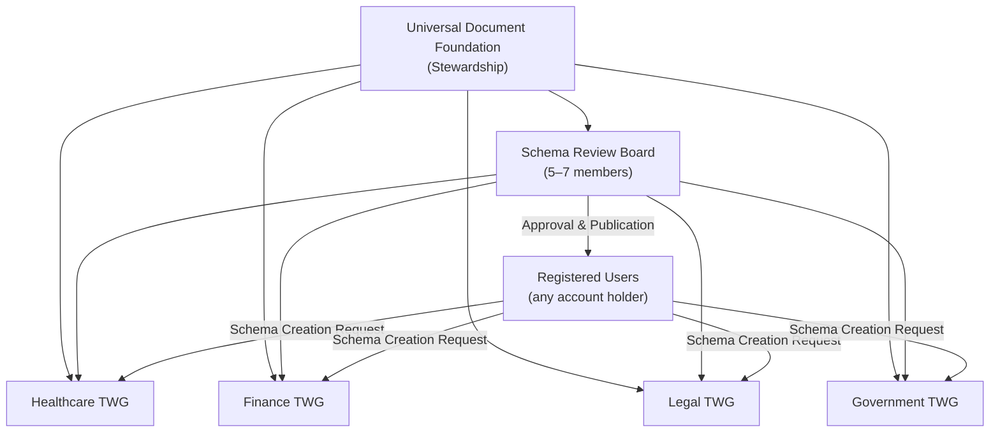
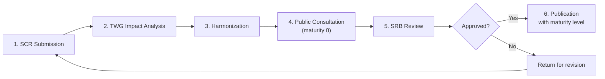

# Universal Document Schema Registry — Governance Model

**Document ID:** UDF-GOV-SR-001  
**Version:** 1.0.0  
**Status:** Draft  
**Maintainer:** Universal Document Foundation (UDF)  
**License:** CC BY 4.0  
**Effective Date:** 2026-06-30  
**Contact:** registry@universaldocument.org

---

## Table of Contents

1. [Purpose and Scope](#1-purpose-and-scope)
2. [Organizational Structure](#2-organizational-structure)
3. [Registration Process](#3-registration-process)
4. [Version Control](#4-version-control)
5. [Licensing and Fee Structure](#5-licensing-and-fee-structure)
6. [Integration with National PKIs](#6-integration-with-national-pkis)
7. [Crypto-Agility Policy](#7-crypto-agility-policy)
8. [Appeals and Dispute Resolution](#8-appeals-and-dispute-resolution)
9. [Amendments to This Document](#9-amendments-to-this-document)
10. [Appendices](#10-appendices)

---

## 1. Purpose and Scope

The **Universal Document Schema Registry** (UDSR, or "the Registry") is the authoritative catalogue of JSON Schema definitions used to validate, extend, and interoperate with Universal Document™ (UD) files — including core iSDF schemas, domain-specific document types (clinical records, financial statements, legal instruments), and custom block schemas referenced via `custom` block types.

This governance document defines:

- The organizational bodies responsible for Registry stewardship and approval
- The end-to-end process for submitting, reviewing, harmonizing, and publishing schemas
- Versioning, notification, and support obligations
- Licensing tiers and fee allocation
- Requirements for validating documents against national public-key infrastructures (PKIs)
- Cryptographic algorithm lifecycle management

The Registry is operated by the **Universal Document Foundation (UDF)** under principles modelled on formal public registries — including Hong Kong's **Central Registry** for company filings — where registration creates a durable public record, submissions undergo formal impact review, and published entries carry legal and technical weight for downstream implementers.

---

## 2. Organizational Structure

### 2.1 Overview



### 2.2 Universal Document Foundation (UDF)

| Attribute | Detail |
|-----------|--------|
| **Role** | Stewardship and operational authority |
| **Responsibilities** | Host and operate the Registry infrastructure; appoint SRB and TWG chairs; publish the approved algorithms list; collect commercial registration fees; maintain public search and API access; enforce licensing terms |
| **Accountability** | Annual public report on registrations, revenue allocation, and crypto-agility compliance |
| **Contact** | registry@universaldocument.org |

UDF does not unilaterally approve schemas. All publications at maturity level 1 (Recommended) or 2 (Standard) require SRB approval.

### 2.3 Schema Review Board (SRB)

| Attribute | Detail |
|-----------|--------|
| **Composition** | 5–7 members |
| **Appointment** | UDF nominates; members serve 2-year renewable terms |
| **Quorum** | 4 of 7 (or 3 of 5 when board is at minimum size) |
| **Approval threshold** | Simple majority of members present |
| **Required expertise** | At least one representative each from: standards body liaison, cryptography, healthcare informatics, financial regulation, and open-source implementation |

**Powers:**

- Final approval or rejection of schema publications at maturity levels 1 and 2
- Escalation of cross-domain conflicts between TWGs
- Ratification of harmonization decisions
- Approval of schema deprecation and sunset timelines
- Review of appeals (see Section 8)

**Restrictions:**

- SRB members with a direct financial interest in a submitted schema must recuse themselves
- SRB may not modify schema content; it approves or returns submissions for revision

### 2.4 Technical Working Groups (TWGs)

Domain-specific TWGs conduct technical review, impact analysis, and harmonization. Initial chartered groups:

| TWG | Domain scope | Example schema families |
|-----|--------------|-------------------------|
| **Healthcare TWG** | Clinical, pharmacy, research, public health | Discharge summaries, prescriptions, consent forms, trial master files |
| **Finance TWG** | Banking, insurance, accounting, ESG | Financial statements, insurance policies, regulatory filings |
| **Legal TWG** | Contracts, litigation, property, wills | Contracts, deposition packages, title chains, powers of attorney |
| **Government TWG** | Public sector, identity, FOI, regulatory | FOI bundles, credentials, policy attestations, regulatory change trackers |

Each TWG is chaired by a UDF-appointed lead and comprises 3–12 volunteer experts. TWGs may form sub-committees for narrow schema families.

**TWG responsibilities:**

- Receive and triage Schema Creation Requests (SCRs) in their domain
- Produce impact analysis reports
- Identify overlaps and conflicts with existing Registry entries
- Propose harmonization mappings (field aliases, extension points, supersession)
- Recommend maturity level and version to SRB
- Maintain domain-specific implementation notes

### 2.5 Registered Users

Any holder of a Universal Document account may:

| Capability | Description |
|------------|-------------|
| **Submit** | File a Schema Creation Request (SCR) |
| **Comment** | Participate in public consultation on draft schemas (maturity 0) |
| **Subscribe** | Receive version notifications for any published schema |
| **Implement** | Download and implement open schemas under CC BY 4.0 |
| **Search** | Query the public Registry catalogue |

Registered Users do not vote on approvals. Influence is exercised through consultation comments, which TWGs must acknowledge in impact analysis reports.

---

## 3. Registration Process

The Registry registration workflow is modelled on Hong Kong's **Central Registry** model for formal document filing: a structured submission creates a durable record, undergoes impact assessment against the existing corpus, is harmonized where conflicts exist, receives board approval, and is published with a defined maturity level and public searchability.

### 3.1 Process Overview



### 3.2 Stage 1 — Schema Creation Request (SCR) Submission

The submitter files an SCR through the Registry portal. Required fields:

| Field | Requirement |
|-------|-------------|
| **Schema identifier** | Reverse-DNS form: `com.example.clinical.discharge` |
| **Proposed title** | Human-readable name |
| **Domain** | Healthcare, Finance, Legal, Government, or Cross-domain |
| **JSON Schema document** | Draft-07 or later; valid against meta-schema |
| **Change type** | New schema, minor revision, major revision, or deprecation |
| **Rationale** | Business and technical justification |
| **Licensing election** | Open (CC BY 4.0) or Commercial ($99/year) |
| **Submitter contact** | Verified account holder |
| **Affected schemas** | Known dependencies or overlaps (if any) |

Upon receipt, UDF assigns a **Registry filing number** (format: `UDSR-YYYY-NNNNN`) and routes the SCR to the appropriate TWG within 5 business days.

### 3.3 Stage 2 — Impact Analysis (TWG)

The assigned TWG completes an impact analysis within **30 calendar days** (60 days for cross-domain SCRs). The report must address:

1. **Technical validity** — Schema parses, validates sample documents, uses consistent naming conventions
2. **Domain fit** — Alignment with sector standards (HL7 FHIR, ISO 20022, UBL, etc.) where applicable
3. **Registry impact** — Overlap, duplication, or conflict with existing entries
4. **Breaking change assessment** — For revisions: semver classification and migration path
5. **Security implications** — Sensitive fields, signing requirements, PKI dependencies
6. **Implementation burden** — Estimated effort for validators and tooling

TWG outcomes:

| Outcome | Next step |
|---------|-----------|
| **Accept for harmonization** | Proceed to Stage 3 |
| **Request revision** | Return to submitter with required changes |
| **Reject** | Close SCR with written rationale; submitter may appeal |

### 3.4 Stage 3 — Harmonization

Before SRB review, the TWG (or a cross-TWG panel for multi-domain schemas) ensures coherence across the Registry:

- **Field aliasing** — Map equivalent fields across related schemas (e.g., `patient_id` ↔ `subject_identifier`)
- **Extension points** — Define `x-ud-extensions` blocks rather than forking core fields
- **Supersession** — Mark older schemas as superseded with explicit `replaces` metadata
- **Namespace discipline** — Prevent identifier collisions in the global catalogue

Harmonization decisions are documented in the SCR record and attached to the publication package.

### 3.5 Stage 4 — Public Consultation (Maturity Level 0)

All SCRs are published at **maturity level 0 (Draft)** for a minimum **28-day consultation period** before SRB review. During consultation:

- The draft schema and impact analysis are publicly visible
- Registered Users may file comments
- The submitter may publish revised drafts (resetting the consultation clock if changes are material)

### 3.6 Stage 5 — Schema Review Board Review

After consultation closes, the TWG forwards a **Recommendation Package** to the SRB containing:

- Final JSON Schema artifact(s)
- Impact analysis report
- Harmonization record
- Summary of consultation comments and responses
- Proposed maturity level (0, 1, or 2)
- Proposed semver version

The SRB convenes within **14 calendar days** of package receipt.

| SRB Decision | Effect |
|--------------|--------|
| **Approve as Recommended (1)** | Published; TWG endorsement; suitable for production pilots |
| **Approve as Standard (2)** | Published; highest maturity; normative for domain |
| **Approve as Draft (0)** | Extended consultation or pilot; not normative |
| **Return for revision** | SCR re-enters Stage 2 or 3 |
| **Reject** | SCR closed; appeal permitted |

### 3.7 Stage 6 — Approval and Publication

Upon SRB approval, UDF publishes the schema to the Registry with:

| Metadata | Description |
|----------|-------------|
| **Registry ID** | Permanent filing number |
| **Schema URI** | `https://registry.universaldocument.org/schemas/{id}/{version}` |
| **Maturity level** | 0, 1, or 2 (see below) |
| **Version** | Semver (see Section 4) |
| **Publication date** | ISO 8601 |
| **License** | CC BY 4.0 or Commercial |
| **Checksum** | SHA-256 of canonical schema JSON |
| **UDS seal** | Optional sealed `.uds` manifest for audit trail |

### 3.8 Maturity Levels

| Level | Name | Meaning | SRB required |
|-------|------|---------|--------------|
| **0** | Draft | Work in progress; may change without semver major bump during consultation | No (TWG publication only) |
| **1** | Recommended | Stable for production use; breaking changes require major version | Yes |
| **2** | Standard | Normative reference for the domain; highest interoperability expectation | Yes (2/3 supermajority for elevation from 1) |

Elevation from maturity 1 to 2 requires evidence of: at least two independent implementations, 90 days at maturity 1 without material defect reports, and TWG unanimous recommendation.

---

## 4. Version Control

### 4.1 Semantic Versioning

All Registry schemas follow **semantic versioning** (`major.minor.patch`):

| Component | When incremented | Compatibility |
|-----------|------------------|---------------|
| **Major** | Breaking changes: removed fields, changed types, renamed required properties | Not backward compatible |
| **Minor** | New optional fields, new enum values, new non-required blocks | Backward compatible for readers |
| **Patch** | Documentation, constraint tightening that rejects previously invalid documents only, metadata | Backward compatible |

Schema URIs are version-pinned. The Registry resolves `latest` aliases separately (see Section 4.3).

### 4.2 Version Notifications

Registered Users may subscribe to schemas individually or by domain tag. UDF issues notifications on:

| Event | Notification channel | Lead time |
|-------|---------------------|-----------|
| New draft (maturity 0) published | Email, RSS, Registry API webhook | Immediate |
| Consultation opening/closing | Email, RSS | Immediate / 7 days before close |
| New Recommended or Standard version | Email, RSS, webhook | Immediate |
| Major version published | Email, RSS, webhook | **90 days** before deprecation of prior major |
| Schema deprecated | Email, RSS, webhook | **180 days** before sunset |
| Security-related patch | Email, RSS, webhook | Immediate; flagged as critical |

Notification preferences are configurable per user account. Webhook delivery is available to commercial registrants and open-source mirror operators.

### 4.3 Support for Latest Two Versions

The Registry maintains active support for the **latest two semver versions** of each published schema at maturity level 1 or 2:

| Support element | Latest version (N) | Previous version (N-1) |
|-----------------|-------------------|------------------------|
| **Public download** | Yes | Yes |
| **Validator inclusion** | Yes (default) | Yes (opt-in via `?version=` or config) |
| **Bug fixes (patch)** | Yes | Yes, for **12 months** after N is published |
| **Security patches** | Yes | Yes, for **12 months** after N is published |
| **New minor features** | Yes | No |
| **Consultation on changes** | Yes | No |

When version N+1 is published:

- Version N becomes N-1
- Version N-2 moves to **archived** status: downloadable but not patched; marked `deprecated` in metadata
- Archived schemas retain permanent URIs for document verification of historical files

Implementers SHOULD pin explicit versions in production systems rather than relying on `latest` resolution.

---

## 5. Licensing and Fee Structure

### 5.1 Open Schemas (CC BY 4.0)

| Attribute | Detail |
|-----------|--------|
| **Cost** | Free |
| **License** | [Creative Commons Attribution 4.0 International (CC BY 4.0)](https://creativecommons.org/licenses/by/4.0/) |
| **Rights** | Copy, modify, distribute, and implement without fee |
| **Obligations** | Attribution to the Registry entry and original schema author |
| **Suitable for** | Community standards, government schemas, UDF core extensions |

Open schemas are the default for all maturity level 2 (Standard) publications unless the SRB grants a rare exception for regulated proprietary content — in which case the schema remains at maturity 1 maximum.

### 5.2 Commercial Schema Registration

| Attribute | Detail |
|-----------|--------|
| **Cost** | **$99 USD per schema per year** |
| **Billing** | Annual, renewed on registration anniversary |
| **License** | Commercial Registry License (proprietary; terms at registry.universaldocument.org/license/commercial) |
| **Rights** | Exclusive commercial registration of the schema identifier; priority TWG review (15-day SLA); enhanced webhook notifications; optional private consultation window before public draft |
| **Restrictions** | Does not restrict others from implementing functionally similar schemas under a different identifier; does not grant trademark rights |

Commercial registration does not exempt schemas from SRB approval, public consultation, or harmonization requirements.

### 5.3 Revenue Allocation

| Recipient | Share | Purpose |
|-----------|-------|---------|
| **Universal Document Foundation** | **70%** | Registry infrastructure, SRB/TWG operations, public API, standards development |
| **Schema Maintenance Fund** | **30%** | Distributed to maintainers of actively registered schemas (open and commercial) based on patch activity, security response, and implementation support |

Maintenance fund distributions are calculated quarterly. Schemas with no active maintainer accrue to UDF for assigned maintenance.

### 5.4 Fee Schedule Summary

| Item | Fee | Frequency |
|------|-----|-----------|
| Account registration | Free | — |
| Open schema publication | Free | — |
| Commercial schema registration | $99 | Per schema, annual |
| Late renewal (commercial) | $99 + $25 | Grace period: 30 days; then identifier suspended |
| Appeal filing | Free | Per appeal |
| Expedited SRB review (optional) | $500 | Per SCR; 7-day SRB SLA |

---

## 6. Integration with National PKIs

The Registry defines how UD schemas reference and validate identity and signing credentials rooted in national and supranational PKI frameworks.

### 6.1 Supported Frameworks

| Framework | Jurisdiction | Registry integration |
|-----------|--------------|-------------------|
| **X-Road** | Estonia, Nordic-Baltic members | `x-ud-signature.trust_service: "xroad"`; Security Server certificate chain validation |
| **BankID** | Sweden, Norway | `x-ud-signature.trust_service: "bankid"`; BankID issuer roots via national RP APIs |
| **eIDAS** | European Union | `x-ud-signature.trust_service: "eidas"`; Qualified certificate validation against EU Trusted List (EUTL) |

Additional frameworks (e.g., UK GPG45, US Federal PKI) may be added by TWG recommendation and SRB approval.

### 6.2 Document Validation Model

Schemas that require national PKI validation MUST include an `x-ud-signature` extension:

```json
{
  "x-ud-signature": {
    "required": true,
    "trust_service": "eidas",
    "minimum_assurance": "substantial",
    "allowed_issuers": ["https://eidas.ec.europa.eu/efda/tl-browser/api/v1/current"],
    "root_validation": "national",
    "algorithm_policy_ref": "https://registry.universaldocument.org/crypto/2026"
  }
}
```

**Validation steps** (normative for maturity level 2 schemas):

1. Extract signing certificate from UDS `seal.signature`
2. Resolve trust service type from schema `x-ud-signature` block
3. Fetch current root/trust list from the framework's authoritative endpoint (cached ≤ 24 hours)
4. Validate certificate chain to a trusted national root
5. Verify signature algorithm against the current UDF Algorithms List (Section 7)
6. Confirm assurance level meets `minimum_assurance`

### 6.3 National Root Certificate Policy

| Rule | Detail |
|------|--------|
| **Root source** | Only roots published by the national supervisory body or EUTL |
| **Cache TTL** | Maximum 24 hours for trust list fetches |
| **Revocation** | OCSP or CRL checking required for Qualified/eIDAS signatures |
| **Fallback** | If trust list is unreachable, validators MAY use last-known-good cache for ≤ 72 hours; beyond that, validation MUST fail closed |
| **Logging** | Chain validation outcomes SHOULD be recorded in `chain_of_custody` events |

### 6.4 Schema Registration Requirements for PKI-Bound Schemas

SCRs for PKI-bound schemas must include:

- Trust service designation and assurance level mapping
- Test vectors with sample certificates (test environment only)
- TWG security review sign-off
- SRB approval at maturity 1 or 2

---

## 7. Crypto-Agility Policy

Cryptographic algorithms used in UD signing and sealing are centrally managed by UDF to ensure forward compatibility with post-quantum requirements and deprecation of weakened algorithms.

### 7.1 Algorithms List

UDF publishes and maintains the **UDF Approved Algorithms List** at:

`https://registry.universaldocument.org/crypto/{year}`

The list is updated **annually** (January) and may receive emergency revisions for critical vulnerabilities.

| Category | Current approved algorithms | Status |
|----------|----------------------------|--------|
| **Hashing** | SHA-256, SHA-384, SHA-512 | Required for UDS canonical hash |
| **Symmetric** | AES-256-GCM | Approved |
| **Signature (classical)** | Ed25519, ECDSA P-256, RSA-3072+ | Ed25519 **deprecated 2035** |
| **Signature (post-quantum)** | ML-DSA (Dilithium) per FIPS 204 | **Required** for new maturity 2 schemas from 2028 |

### 7.2 Deprecation Timeline

| Algorithm | Milestone | Date | Requirement |
|-----------|-----------|------|-------------|
| **Ed25519** | Deprecation announced | 2026-01 | UDF Algorithms List |
| **Ed25519** | New schemas (maturity 2) | 2028-01-01 | ML-DSA required for new Standard schemas |
| **Ed25519** | Existing schemas | 2030-01-01 | Migration plan required in SCR metadata |
| **Ed25519** | End of support | **2035-12-31** | Validation MUST reject Ed25519 for new seals |
| **ML-DSA** | Recommended | 2026-01 | Optional for all schemas |
| **ML-DSA** | Required (maturity 2) | **2028-01-01** | Mandatory for new Standard publications |
| **ML-DSA** | Required (all) | **2032-01-01** | Mandatory for all new seals |

### 7.3 Schema Publisher Obligations

Schemas at maturity 1 or 2 MUST declare supported algorithms:

```json
{
  "x-ud-crypto": {
    "hash": ["sha-256"],
    "signature": ["ml-dsa-65", "ed25519"],
    "policy_ref": "https://registry.universaldocument.org/crypto/2026",
    "migration_deadline": "2030-06-30"
  }
}
```

Validators MUST reject seal algorithms not present in the schema's declared set or the current UDF Algorithms List.

### 7.4 Emergency Revocation

UDF may issue an **Emergency Algorithm Revocation Notice** outside the annual cycle when:

- A practical break is demonstrated against an approved algorithm
- A national authority (e.g., NIST, ENISA) deprecates an algorithm with immediate effect

Emergency revocations take effect 30 days after publication unless a shorter period is justified. SRB may grant per-schema exceptions for legacy document verification (read-only) for up to 12 months.

---

## 8. Appeals and Dispute Resolution

| Stage | Authority | Timeline |
|-------|-----------|----------|
| **1. TWG reconsideration** | Original TWG | 14 days from appeal filing |
| **2. SRB review** | Schema Review Board | 30 days from TWG non-resolution |
| **3. UDF final determination** | UDF Stewardship Council | 30 days from SRB non-resolution |

Appeals must cite specific grounds: procedural error, undisclosed conflict of interest, or materially incorrect impact analysis. Appeals do not guarantee schema approval.

Cross-TWG domain disputes (e.g., a healthcare-financial schema) are escalated directly to SRB at Stage 2.

---

## 9. Amendments to This Document

Amendments to this governance model require:

1. Draft amendment published for 28-day public consultation
2. SRB approval by simple majority
3. UDF ratification
4. Version increment of this document (semver)
5. Notification to all Registered Users

Material changes to fee structure or crypto-agility timelines require **60-day** consultation.

---

## 10. Appendices

### Appendix A — Roles and Responsibilities Matrix

| Activity | UDF | SRB | TWG | Registered User |
|----------|-----|-----|-----|-----------------|
| Operate Registry infrastructure | ✓ | | | |
| Submit SCR | | | | ✓ |
| Impact analysis | | | ✓ | |
| Harmonization | | | ✓ | |
| Public consultation comment | | | | ✓ |
| Approve maturity 1/2 | | ✓ | | |
| Publish algorithms list | ✓ | | | |
| Collect commercial fees | ✓ | | | |
| Maintain schema (post-publication) | | | ✓ (chair) | ✓ (maintainer) |
| Subscribe to notifications | | | | ✓ |
| File appeal | | | | ✓ |
| Resolve appeal (final) | ✓ | ✓ | | |

### Appendix B — SCR Checklist

- [ ] Valid JSON Schema (draft-07+)
- [ ] Reverse-DNS identifier proposed
- [ ] Domain TWG selected
- [ ] Rationale document attached
- [ ] Licensing election (open or commercial)
- [ ] Sample valid/invalid documents provided
- [ ] Affected schemas identified
- [ ] `x-ud-signature` block (if PKI-bound)
- [ ] `x-ud-crypto` block (if maturity ≥ 1)
- [ ] Semver change type declared

### Appendix C — Glossary

| Term | Definition |
|------|------------|
| **SCR** | Schema Creation Request — formal filing to register a schema |
| **TWG** | Technical Working Group — domain expert review body |
| **SRB** | Schema Review Board — approval authority |
| **UDF** | Universal Document Foundation — Registry steward |
| **Maturity level** | 0 Draft, 1 Recommended, 2 Standard |
| **Harmonization** | Process of aligning overlapping schemas to reduce fragmentation |
| **ML-DSA** | Module-Lattice-Based Digital Signature Algorithm (FIPS 204) |

### Appendix D — Related Documents

| Document | Location |
|----------|----------|
| iSDF v0.1.0 Specification | `spec/v0.1.0/iSDF-spec.md` |
| UD JSON Schema | `spec/v0.1.0/ud.schema.json` |
| Universal Document Whitepaper | `apps/landing/public/whitepaper/` |
| UDF Algorithms List | `https://registry.universaldocument.org/crypto/{year}` |

---

*This document is published by the Universal Document Foundation under CC BY 4.0. Implementers may cite it as: Universal Document Foundation (2026). Universal Document Schema Registry — Governance Model v1.0.0.*
